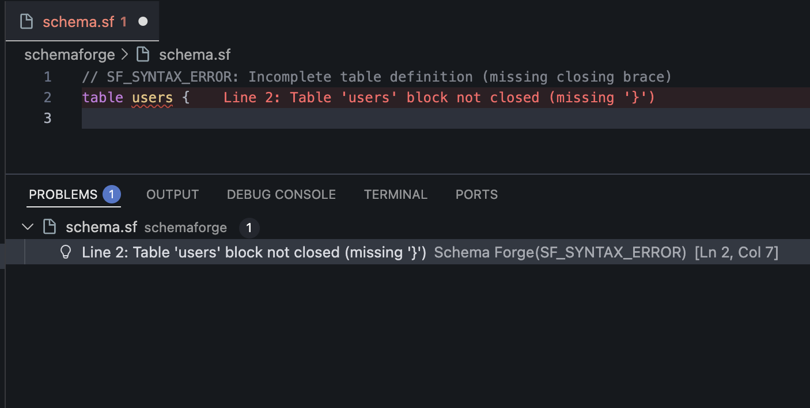
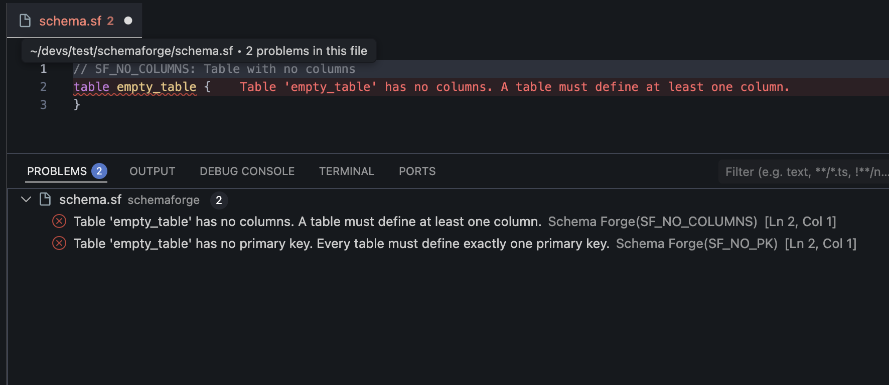
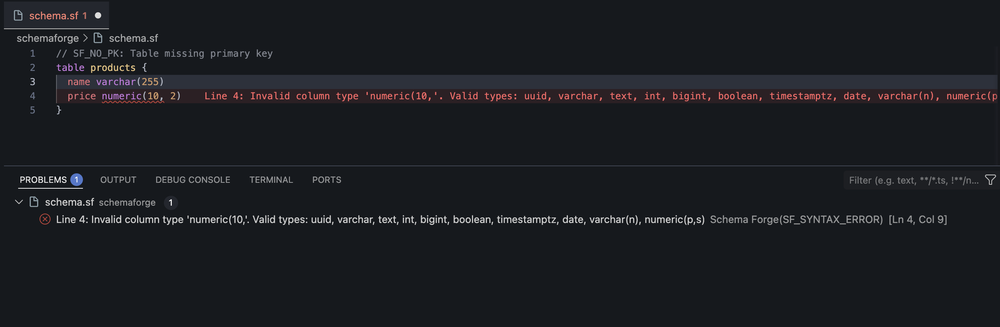
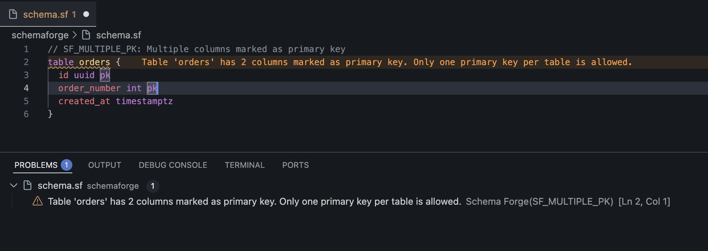
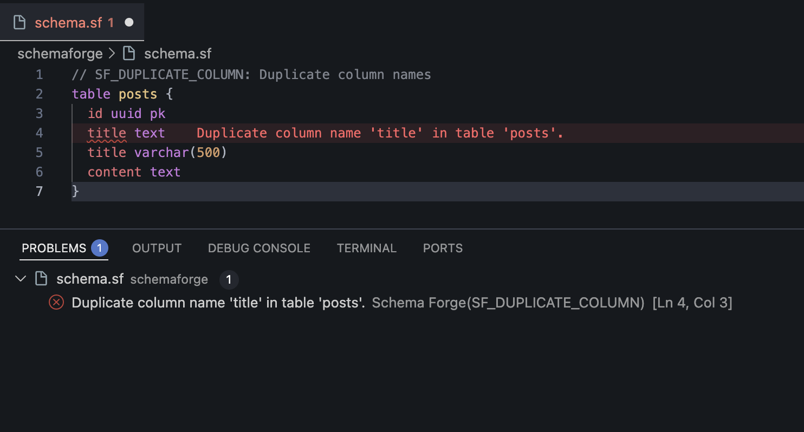
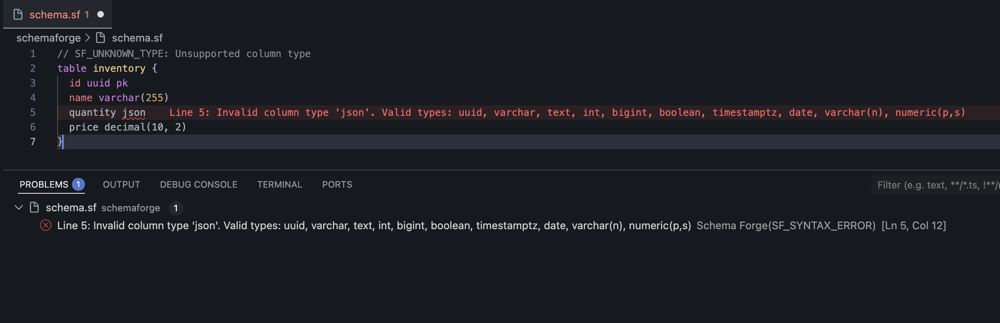
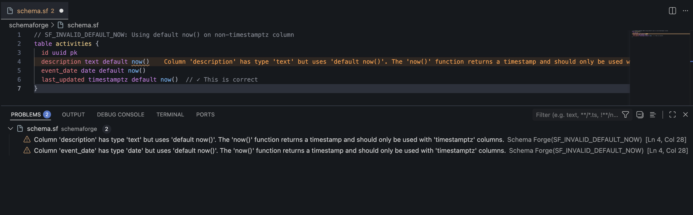
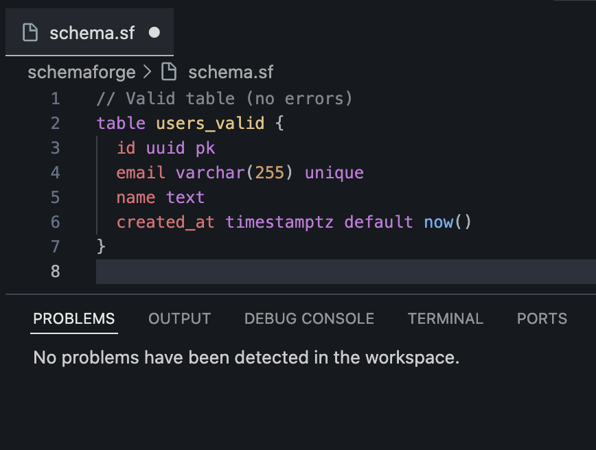
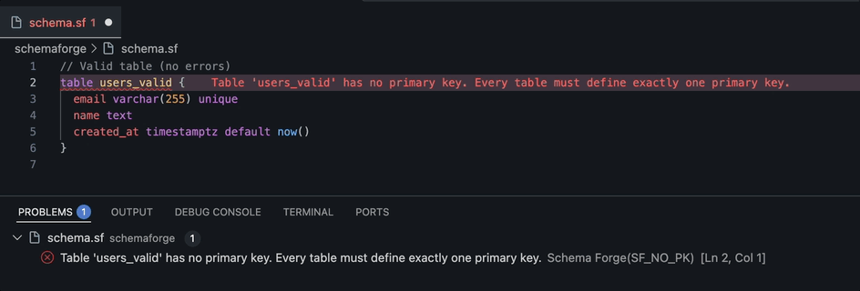

# Schema Forge for VS Code

Official VS Code and Open VSX extension for the Schema Forge DSL (`.sf`).

Build and manage Schema Forge projects directly in your editor with native language support and command integration.

**Website:** [schemaforge.xuby.cl](https://schemaforge.xuby.cl/)

👉 [Install from Visual Studio Marketplace](https://marketplace.visualstudio.com/items?itemName=Xubylele.schema-forge)

👉 [Install from Open VSX](https://open-vsx.org/extension/xubylele/schema-forge)

## Why use this extension

- Native support for `.sf` files
- Built-in snippets for faster schema authoring
- Command Palette actions for core workflows
- Automatic prompt to initialize missing Schema Forge project structure

## What's New in [0.3.0]

**New commands & editor features**

- **Schema Forge: Diff Preview** — Generate SQL diff previews in a dedicated panel
- **Schema Forge: Preview SQL** — Preview SQL generated from schema differences (also in editor title bar and status bar)
- **Schema drift status bar** — Status bar shows drift state; updates when running Diff
- **Completion provider** — Autocomplete for base types, parameterized types, constraint modifiers, and default values


## Phase 1: CLI Commands

Open the Command Palette and run:

- `Schema Forge: Init` — Initializes a new Schema Forge project
- `Schema Forge: Generate` — Generates SQL migrations from schema
- `Schema Forge: Diff` — Shows schema differences
- `Schema Forge: Diff Preview` — Opens a panel with SQL diff preview
- `Schema Forge: Visual Diff` — Opens a structured view of schema changes (operations and safety findings) with links to SQL preview
- `Schema Forge: Preview SQL` — Previews SQL from schema differences

**Status bar:** Click the Schema Forge status bar item to open a menu (Run Diff Preview, Open Visual Diff, Generate). The status bar shows pending / drift / clean and briefly "checking..." after save while diff runs.

## Phase 2: Editor Features

### Diagnostics

Errors and warnings appear in VS Code's **Problems** panel (`Ctrl+Shift+M` / `Cmd+Shift+M`). Rules run on file save (immediate) and on change (debounced 250ms).

| Code | Description | Severity |
| ------ | ------------- | ---------- |
| `SF_SYNTAX_ERROR` | Parsing error in schema file | Error |
| `SF_NO_COLUMNS` | Table has no columns defined | Error |
| `SF_NO_PK` | Table is missing a primary key | Error |
| `SF_MULTIPLE_PK` | Table has multiple primary key columns | Warning |
| `SF_DUPLICATE_COLUMN` | Duplicate column names in table | Error |
| `SF_UNKNOWN_TYPE` | Unsupported or unknown column type | Error |
| `SF_INVALID_DEFAULT_NOW` | `default now()` used on non-timestamptz column | Warning |


*Problems panel showing real-time diagnostics with all 7 rule codes*

#### Diagnostic Examples

**SF_SYNTAX_ERROR** — Parsing error in schema file


*Table definition not properly closed*

**SF_NO_COLUMNS** — Table has no columns defined


*Table with no column definitions*

**SF_NO_PK** — Table is missing a primary key


*Table without a primary key column*

**SF_MULTIPLE_PK** — Table has multiple primary key columns


*Table with more than one primary key*

**SF_DUPLICATE_COLUMN** — Duplicate column names in table


*Same column name defined twice*

**SF_UNKNOWN_TYPE** — Unsupported or unknown column type


*Using an unsupported data type*

**SF_INVALID_DEFAULT_NOW** — `default now()` used on non-timestamptz column


*Using default now() on wrong column type*

**Valid Schema** — No errors


*Properly structured schema with all validations passing*

### Hover Docs

Hover over DSL keywords to see in-editor documentation:

- **table** — Declares a database table
- **uuid** — 128-bit unique identifier type (pairs with `gen_random_uuid()`)
- **text** — Unbounded variable-length string
- **varchar** — Variable-length string with optional limit (e.g., `varchar(255)`)
- **timestamptz** — Timestamp with timezone (use with `default now()`)
- **pk** — Primary key modifier
- **unique** — Unique constraint modifier
- **default** — Default value modifier (e.g., `default now()`, `default true`)

### Quick Fixes

When applicable diagnostics are present, a lightbulb icon appears. Press `Ctrl+.` (Cmd+. on macOS) to open Quick Fixes:

### Add primary key column**

- Triggered by: `SF_NO_PK`
- Action: Inserts `{columnName} uuid pk` at the table start
- Smart naming: Auto-selects available name from `id` → `pk_id` → `{tableName}_id` → `id_pk`
- Preserves indentation and existing structure

### Convert to 'id uuid pk'

- Triggered by: `SF_NO_PK` on a column definition
- Action: Rewrites selected column to `id uuid pk` format
- Safety: Prevents conversion if table already has an `id` column
- Removes conflicting `pk` modifiers on rewrite


*Quick Fix lightbulb converts a column to 'id uuid pk'*

## Compatibility & Limitations

**Semantic Validation**: Rules are MVP-level and provider-agnostic (compatible with Postgres, Supabase, and other Postgres-based systems).

**Language Recognition**: Editor intelligence requires:

- File extension: `.sf`
- Language mode: "Schema Forge" (auto-detected, or manually set)

**Supported Column Types**: uuid, varchar, varchar(n), text, int, bigint, numeric(m,n), boolean, timestamptz, date

**Phase 1 vs Phase 2**: CLI commands (Init, Generate, Diff) execute the Schema Forge CLI. Editor features (Diagnostics, Hover, Quick Fixes) use the core library without spawning processes.

## Configuration

**Settings (coming soon)** — Phase 3 will introduce configuration for diagnostic severity overrides and feature toggles.

## Troubleshooting

**Q: Diagnostics are not showing**  
A: Ensure the file ends with `.sf` and the language mode is "Schema Forge". Check View → Output and select "Schema Forge" from the dropdown to see detailed logs.

**Q: Quick Fix is not offered**  
A: Quick Fixes appear only when a matching diagnostic is present. Check the Problems panel (`Ctrl+Shift+M`) for applicable errors (e.g., `SF_NO_PK`).

**Q: "Core parse fails" or syntax error**  
A: Check the Problems panel for `SF_SYNTAX_ERROR` diagnostic. Review your schema syntax against the [Schema Forge documentation](https://github.com/xubylele/schema-forge).

## Language Support

The extension contributes:

- Language ID: `schema-forge`
- File extension: `.sf`
- Scope name: `source.schemaforge`

## Installation

### Marketplace (recommended)

Install directly from the [Visual Studio Marketplace](https://marketplace.visualstudio.com/items?itemName=Xubylele.schema-forge).

Install from [Open VSX](https://open-vsx.org/extension/xubylele/schema-forge) (Cursor/VSCodium compatible).

### Build from source

```bash
git clone https://github.com/xubylele/schema-forge-vscode.git
cd schema-forge-vscode
npm install
npm run build
```

Then press `F5` in VS Code to launch an Extension Development Host.

### Install as VSIX

```bash
npm run package:vsix
```

In VS Code, run **Extensions: Install from VSIX...** and choose the generated file.

## Quick Start

1. Open a workspace.
2. Create or open a `.sf` file.
3. Run `Schema Forge: Init` if your `schemaforge/` folder does not exist.
4. Use `Schema Forge: Generate`, `Schema Forge: Diff`, `Schema Forge: Diff Preview`, or `Schema Forge: Preview SQL` from the Command Palette.

## Development

```bash
npm install
npm run watch
```

Useful scripts:

- `npm run build`
- `npm run lint`
- `npm test`

## Contributing

Contributions are welcome. Please follow [CONTRIBUTING.md](CONTRIBUTING.md).

All contributor pull requests must target the `develop` branch.

## Release Channels

- `pre-release`: publishes prerelease versions (`X.Y.Z-next.N`)
- `master`: publishes stable versions (`X.Y.Z`)

## Related Packages

- [@xubylele/schema-forge](https://www.npmjs.com/package/@xubylele/schema-forge)
- [@xubylele/schema-forge-core](https://www.npmjs.com/package/@xubylele/schema-forge-core)

## License

MIT